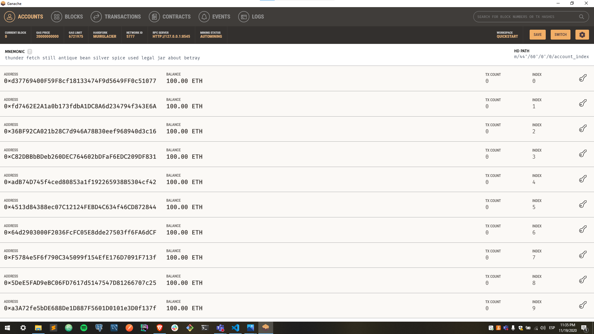
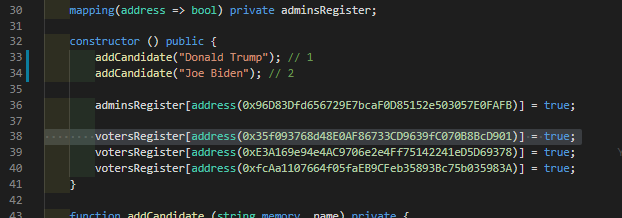
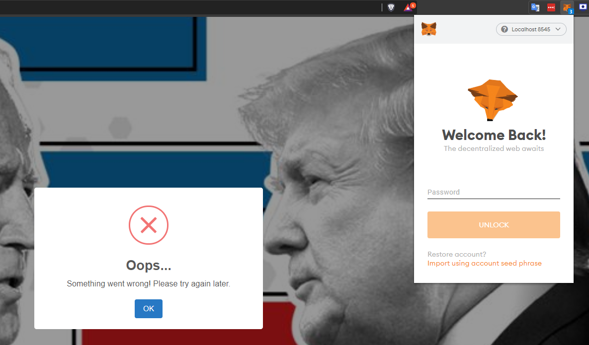
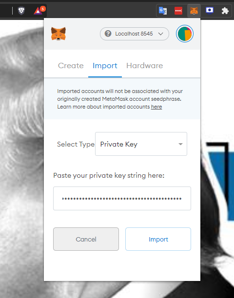
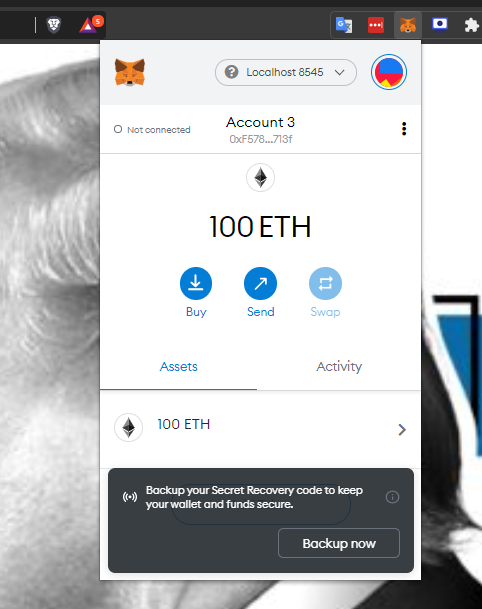
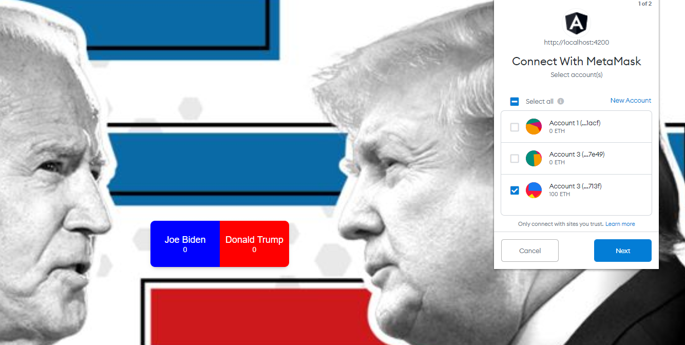
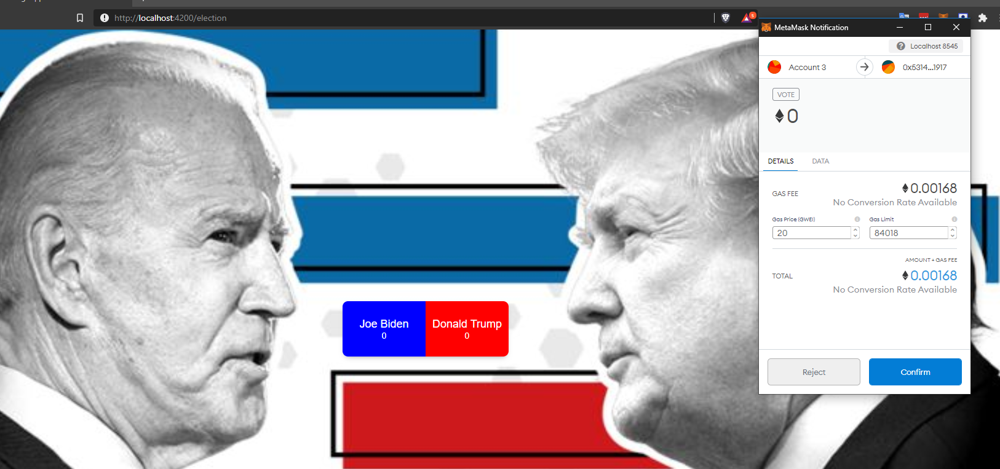
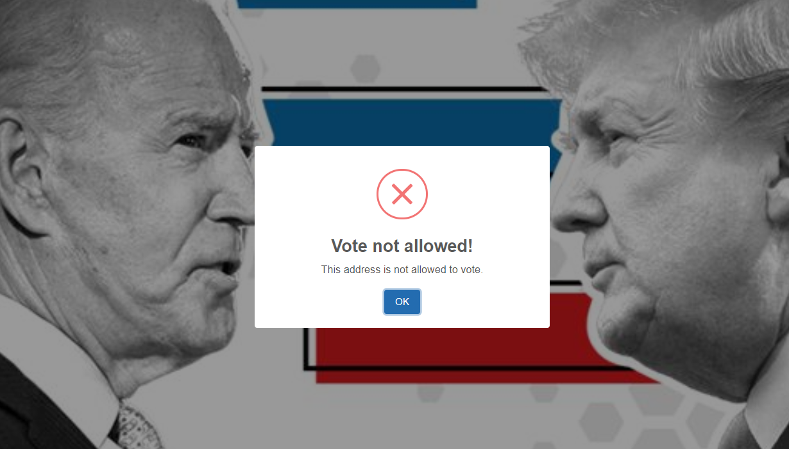

# Ethereum and Angular Voting DApp

## Setup

- Instalar metamask en el navegador (Chrome, Firefox, Brave o Edge)
- Instalar el "packet manager" de Node (NPM).

Luego, parado en el directorio "root" de este proyecto ejecutar los siguientes comandos en la consola:

- npm install -g truffle
- npm install -g @angular/cli
- npm install
- truffle compile
- truffle migrate --reset

- cd web
- npm install
- ng serve

# Deployment

## 1. Ganache:

Descargar e instalar Ganache. Luego de instalado, ejecutarlo y seleccionar la opción de "Quickstart" para que Ganache cree 10 wallets con 100 Ethers cada una. Estas wallets son las que se usarán para interactuar con la aplicación.

## 2. Tomar de Ganache un address e ingresarlo en el constructor del contrato Election.sol, ubicado en /contracts:
  adminsRegister[address(** address **)] = true;

  

## 3. Ejecutar los comandos:
  - truffle compile
  - truffle migrate --reset

## 4. Moverse a la carpeta /web, y levantar localmente la web app
  - cd web
  - ng serve

## 5. Dirigirse a http://localhost:4200 y en metamask, iniciar sesión en localhost:8545 (se asume que Ganache se levantó en el puerto 8545)

  

## 6. Importar una cuenta a metamask

  

  

## 7. Refrescar y conectar la cuenta ingresada. Refrescar nuevamente.

  

## 8. Si su address es uno habilitado para votar y no se usó para votar todavía, podrá hacerlo, de lo contrario será rechazado.

  

  

